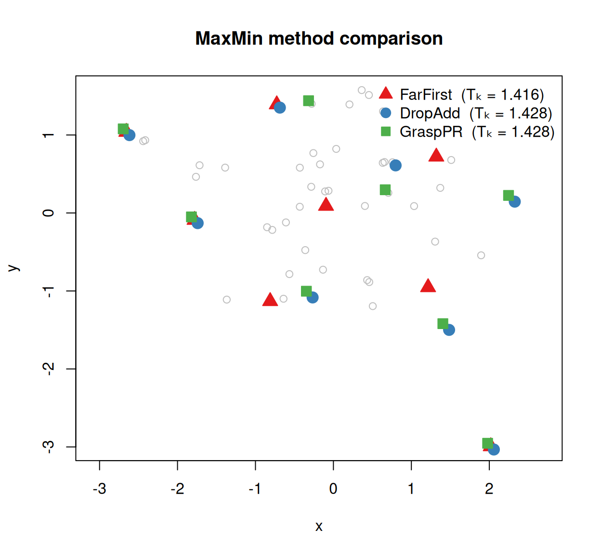

# Introduction to MaxMin

The **Max-Min Diversity Problem** (MMDP) asks: given a fixed set of *N*
candidate items and a distance between every pair, choose *m* items so
that the closest pair in the selection is as far apart as possible. The
objective — often written T_(k) — is the minimum pairwise distance
within the chosen subset; a larger T_(k) means a more spread-out,
representative selection.

This problem arises naturally wherever you want a diverse sample from a
fixed pool: selecting field-survey sites to cover a landscape, picking
biological specimens for sequencing that span the available genetic
diversity, or choosing a representative subset of protein structures
from a database.

## Installation

``` r

install.packages("MaxMin")
```

For the exact solver, also install **highs**:

``` r

install.packages("highs")
```

## Quick start

`eurodist` is a built-in R `dist` object containing road distances (km)
between 21 European cities.

``` r

data(eurodist)

# Select 4 maximally dispersed cities
idx <- Gonzalez(eurodist, n = 4L)

as.matrix(eurodist)[idx, idx]
#>           Lisbon Athens Stockholm Milan
#> Lisbon         0   4532      3231  2250
#> Athens      4532      0      3927  2282
#> Stockholm   3231   3927         0  2187
#> Milan       2250   2282      2187     0

labels(eurodist)[idx]
#> [1] "Lisbon"    "Athens"    "Stockholm" "Milan"
TkScore(eurodist, idx)
#> [1] 2187
```

[`Gonzalez()`](https://ms609.github.io/MaxMin/reference/Gonzalez.md)
returned the indices of the four cities whose nearest-neighbour distance
within the selection is largest.
[`TkScore()`](https://ms609.github.io/MaxMin/reference/TkScore.md)
reports that value explicitly.

## Methods at a glance

MaxMin provides four solvers and two utilities:

| Function | Quality | Speed | Stochastic? |
|----|----|----|----|
| [`Gonzalez()`](https://ms609.github.io/MaxMin/reference/Gonzalez.md) | Good (2-approximation) | Very fast | No |
| [`DropAddTS()`](https://ms609.github.io/MaxMin/reference/DropAddTS.md) | High (≈ 99 % optimal) | Fast | No |
| [`GraspPR()`](https://ms609.github.io/MaxMin/reference/GraspPR.md) | Highest | Moderate | Yes (`seed =`) |
| [`ExactMaxMin()`](https://ms609.github.io/MaxMin/reference/ExactMaxMin.md) | Optimal (NP-hard) | Slow | No |
| [`PolishSelection()`](https://ms609.github.io/MaxMin/reference/PolishSelection.md) | Post-processing only | Very fast | No |
| [`TkScore()`](https://ms609.github.io/MaxMin/reference/TkScore.md) | Scoring only | Instant | No |

The rest of this vignette walks through each in turn.

------------------------------------------------------------------------

## Gonzalez: fast greedy selection

The **Gonzalez** (1985) algorithm builds the selection greedily: start
from a seed point, then repeatedly add whichever unselected point is
farthest from the current selection. This greedy rule guarantees a
2-approximation to the optimal T_(k) and runs in O(*N* · *m*) time.

By default `seed = c("diameter", "anti_medoid", "rowsum", "rownorm")`:
all four peripheral seeding strategies run and whichever produced the
highest T_(k) is returned. Pass a shorter character vector to use a
subset, or a single name for one strategy.

``` r

idx_ens <- Gonzalez(eurodist, n = 6L)   # default: four-anchor ensemble

# Which seeding strategy won?
attr(idx_ens, "winning_strategy")
#> [1] "diameter"    "anti_medoid" "rowsum"      "rownorm"
```

You can also request a specific seeding strategy or a custom ensemble
subset:

``` r

idx_diam <- Gonzalez(eurodist, n = 6L, seed = "diameter")
TkScore(eurodist, idx_diam)
#> [1] 1014

idx_anti <- Gonzalez(eurodist, n = 6L, seed = "anti_medoid")
TkScore(eurodist, idx_anti)
#> [1] 1014
```

When only pairwise distances between objects are known — there are no
coordinates to work from — and computing or storing all N×N distances at
once would be too expensive (e.g. large phylogenetic trees, where each
tree-to-tree distance requires its own calculation), pass
[`Gonzalez()`](https://ms609.github.io/MaxMin/reference/Gonzalez.md) a
*function* in place of the distance matrix. The function takes one index
`i` and returns the distances from object `i` to all N objects — one
column of the matrix. Gonzalez calls it only *n* times, so the full N×N
matrix is never built; you must supply `N` (the number of objects),
since it cannot be read off a function.

``` r

dm <- as.matrix(eurodist)
col_of <- function(i) dm[, i]       # one column on demand
Gonzalez(col_of, n = 6L, N = nrow(dm), seed = 1L)
#> [1]  1 12 20 16  5  2
```

(Here the column simply indexes a matrix we already have, to keep the
example self-contained; the point is that `col_of` could instead
*compute* each column from trees, sequences, or any metric with no
coordinate embedding.) Only an integer `seed` (a fixed start index) or
the default peripheral seed is available on this path — the richer
ensemble anchors need the whole matrix.

------------------------------------------------------------------------

## DropAdd tabu search

The **DropAdd** heuristic (Porumbel, Hao & Glover 2011) refines an
initial selection by alternating *drop* and *add* moves guided by a FIFO
tabu list that prevents short cycles. It is fully deterministic and
reproducible, and typically reaches ≈ 99 % of the optimal T_(k).

``` r

res_da <- DropAddTS(eurodist, m = 6L, max_no_improve = 500L)

labels(eurodist)[res_da$indices]
#> [1] "Athens"    "Barcelona" "Cherbourg" "Lisbon"    "Stockholm" "Vienna"
res_da$objective     # T_k achieved
#> [1] 1294
res_da$iters         # iterations completed
#> [1] 516
res_da$time_s        # wall-clock seconds
#> [1] 0.000254631
```

`max_no_improve` is the main stopping knob: the algorithm terminates
after this many consecutive iterations without an improvement in T_(k).
For coordinate data where *N* is large enough to make the distance
matrix infeasible (roughly N \> 46 000), use
[`DropAddTSPoints()`](https://ms609.github.io/MaxMin/reference/DropAddTSPoints.md),
which accepts a coordinate matrix directly.

------------------------------------------------------------------------

## GRASP with path relinking

**GRASP + path relinking** (Resende et al. 2010) combines a *randomised*
greedy construction phase with extended local search and then refines an
elite set of good solutions by interpolating between elite-pair
trajectories (*path relinking*). It achieves the highest T_(k) of the
three heuristics, at a proportionally higher cost. Because the
construction phase is stochastic, always set `seed` for reproducibility:

``` r

res_gr <- GraspPR(eurodist, m = 6L, max_no_improve = 50L, seed = 42L)

labels(eurodist)[res_gr$indices]
#> [1] "Athens"    "Barcelona" "Calais"    "Lisbon"    "Stockholm" "Vienna"
res_gr$objective
#> [1] 1305
res_gr$pr_calls   # path-relinking calls performed
#> [1] 90
```

`max_no_improve` controls how many consecutive non-improving GRASP
iterations trigger termination; `time_budget_s` is available as an
absolute time cap for interactive or batch use.

------------------------------------------------------------------------

## Comparing methods on a simulated example

To see how the methods relate visually, we generate 50 points in two
dimensions and select *m* = 8 from each.

``` r

set.seed(42)
pts <- matrix(rnorm(100), ncol = 2)   # 50 points, 2 dimensions
d50 <- dist(pts)
m   <- 8L
```

``` r

idx_gonz <- Gonzalez(d50, n = m)
res_da50 <- DropAddTS(d50, m = m, max_no_improve = 500L)
res_gr50 <- GraspPR(d50, m = m, max_no_improve = 50L, seed = 42L)
```

Even a small difference in T_(k) can correspond to a meaningfully more
dispersed selection.

``` r

scores <- c(
  Gonzalez  = TkScore(d50, idx_gonz),
  DropAddTS = res_da50$objective,
  GraspPR   = res_gr50$objective
)
round(scores, 3)
#>  Gonzalez DropAddTS   GraspPR 
#>     1.416     1.428     1.428
```

Plotting the selections against the point cloud makes the differences
concrete. When two methods select the same index, their symbols overlap;
the T_(k) table above captures the quality distinction even when the
visual overlap is high.

``` r

methods <- list(
  Gonzalez  = idx_gonz,
  DropAddTS = res_da50$indices,
  GraspPR   = res_gr50$indices
)
cols <- c(Gonzalez = "#E41A1C", DropAddTS = "#377EB8", GraspPR = "#4DAF4A")
pchs <- c(Gonzalez = 24L, DropAddTS = 21L, GraspPR = 22L)
# Small per-method shift so coincident selections remain distinguishable
dx   <- c(Gonzalez = 0, DropAddTS =  0.04, GraspPR = -0.04)
dy   <- c(Gonzalez = 0, DropAddTS = -0.04, GraspPR =  0.04)

plot(pts, pch = 1L, col = "grey75", asp = 1L,
     xlab = "x", ylab = "y",
     main = "MaxMin method comparison")

for (nm in names(methods)) {
  sel <- methods[[nm]]
  points(
    pts[sel, 1L] + dx[nm],
    pts[sel, 2L] + dy[nm],
    pch = pchs[nm], col = cols[nm], bg = cols[nm], cex = 1.6
  )
}

legend("topright",
       legend = paste0(names(methods), "  (Tₖ = ", round(scores, 3), ")"),
       pch = pchs, col = cols, pt.bg = cols, pt.cex = 1.4, bty = "n")
```



Selections returned by each method on 50 random 2-D points (m = 8).
Coloured symbols mark selected points; grey circles are the full
candidate set. A small jitter separates symbols at shared indices.

------------------------------------------------------------------------

## Exact solution

For small instances (roughly N ≤ 25–30),
[`ExactMaxMin()`](https://ms609.github.io/MaxMin/reference/ExactMaxMin.md)
solves the problem to proven optimality via a node-packing integer
programme (Sayyady & Fathi 2016), using the **highs** solver.

``` r

set.seed(1L)
pts30 <- matrix(rnorm(60L), ncol = 2L)
d30   <- dist(pts30)
```

``` r

res_ex <- ExactMaxMin(d30, m = 6L, time_budget_s = 30L)

res_ex$proven      # TRUE  ⟹  objective is the global optimum
#> [1] TRUE
res_ex$objective
#> [1] 1.616311

# Compare to the greedy heuristic on the same instance
res_gonz30 <- Gonzalez(d30, n = 6L)
c(exact    = res_ex$objective,
  Gonzalez = TkScore(d30, res_gonz30))
#>    exact Gonzalez 
#> 1.616311 1.616311
```

`$proven = TRUE` certifies that no selection can achieve a higher T_(k).
[`ExactMaxMin()`](https://ms609.github.io/MaxMin/reference/ExactMaxMin.md)
is NP-hard; instances with more than ~30 candidates require a time
budget or should be tackled with the heuristics above.

------------------------------------------------------------------------

## Scoring and polish

### `TkScore()`

[`TkScore()`](https://ms609.github.io/MaxMin/reference/TkScore.md)
computes the T_(k) objective for any index set. It accepts a `dist`
object, a square distance matrix, or a coordinate matrix via the
`points` argument:

``` r

TkScore(d50, idx_gonz)                               # from dist
#> [1] 1.416314
TkScore(as.matrix(d50), idx_gonz)                    # from square matrix
#> [1] 1.416314
TkScore(points = pts, idx = idx_gonz)                # from coordinates
#> [1] 1.416314
```

### `PolishSelection()`

[`PolishSelection()`](https://ms609.github.io/MaxMin/reference/PolishSelection.md)
applies a 1-swap local search anchored on the *critical edge* — the pair
realising T_(k) — and is a fast post-processor for any greedy selector.
Applying it to a single-seed (weaker) Gonzalez result often recovers a
few extra units of T_(k):

``` r

idx_raw      <- Gonzalez(d50, n = m, seed = "first")   # single, weaker seed
TkScore(d50, idx_raw)
#> [1] 1.322782

idx_polished <- PolishSelection(d50, idx_raw)
TkScore(d50, idx_polished)
#> [1] 1.416314

attr(idx_polished, "swaps")   # number of improving swaps applied
#> [1] 1
```

------------------------------------------------------------------------

## When to use which method

| Scenario | Recommended |
|----|----|
| Speed matters most, N up to a few thousand | [`Gonzalez()`](https://ms609.github.io/MaxMin/reference/Gonzalez.md) (ensemble default) |
| Deterministic, reproducible refinement | [`DropAddTS()`](https://ms609.github.io/MaxMin/reference/DropAddTS.md) |
| Best quality, set `seed` for reproducibility | `GraspPR(seed = ...)` |
| N \> 46 000 (distance matrix infeasible) | [`DropAddTSPoints()`](https://ms609.github.io/MaxMin/reference/DropAddTSPoints.md) or `Gonzalez(points = ...)` |
| Arbitrary metric with no coordinate embedding | `Gonzalez(<column function>, N = ...)` |
| Proven optimum, N ≤ ~ 25–30, **highs** installed | [`ExactMaxMin()`](https://ms609.github.io/MaxMin/reference/ExactMaxMin.md) |
| Post-process any selection cheaply | [`PolishSelection()`](https://ms609.github.io/MaxMin/reference/PolishSelection.md) |

The heuristics are complementary:
[`Gonzalez()`](https://ms609.github.io/MaxMin/reference/Gonzalez.md) is
O(*N* · *m*) and deterministic — an instant first result.
[`DropAddTS()`](https://ms609.github.io/MaxMin/reference/DropAddTS.md)
is deterministic and reproducible (no RNG), typically reaching ≈ 99 % of
optimal; the `seed` parameter governs only the RNG used for
tie-breaking, not the algorithm itself.
[`GraspPR()`](https://ms609.github.io/MaxMin/reference/GraspPR.md) is
stochastic and usually edges out
[`DropAddTS()`](https://ms609.github.io/MaxMin/reference/DropAddTS.md)
on T_(k), but requires a `seed` for reproducibility. For any of these,
[`PolishSelection()`](https://ms609.github.io/MaxMin/reference/PolishSelection.md)
can squeeze out further improvement at negligible cost.

## Related packages

The CRAN package
[**maximin**](https://CRAN.R-project.org/package=maximin) constructs
continuous space-filling designs by generating new points.
